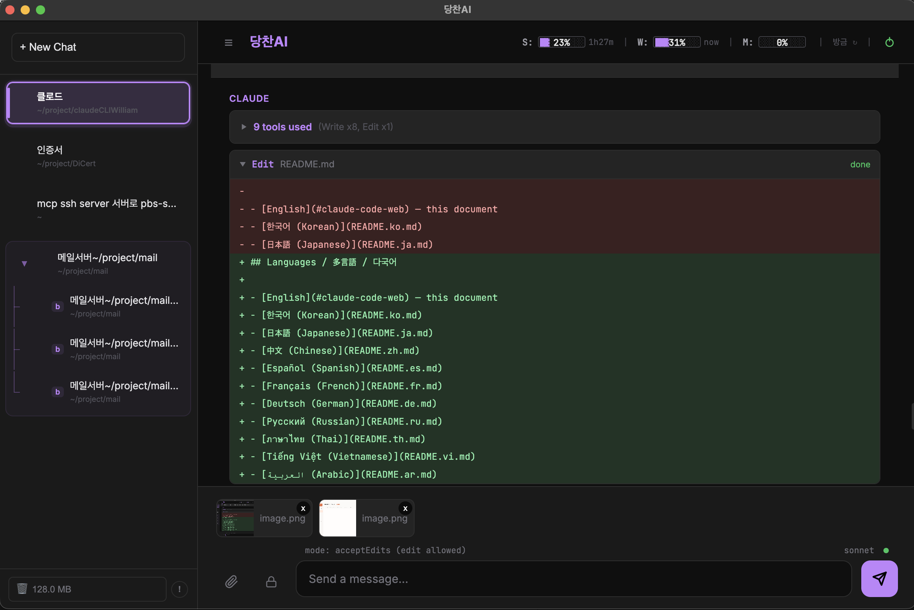

# Claude Code Web

**Use Claude Code entirely in your browser — no terminal required.**

A lightweight web UI that wraps the [Claude Code CLI](https://docs.anthropic.com/en/docs/claude-code/overview) with persistent sessions, real-time usage gauges, model switching, and file attachments. Works on **macOS** and **Windows**.

---



> **Session sidebar** (left) · **Diff view for edits** (center) · **S/W/M usage gauges** (top right)

---

## Why?

Claude Code CLI is powerful, but requires a terminal. This project wraps it in a clean browser UI so that anyone on the team — not just terminal users — can use Claude Code's full capabilities.

---

## Features

### Chat Interface
- Streaming responses with Markdown rendering (code blocks, tables, lists)
- IME support (Korean/Japanese/Chinese composition — no accidental Enter sends)
- Multi-line input with Shift+Enter

### Tool Usage Display
- **Edit** — inline diff view (red deletions, green additions)
- **Bash** — terminal-style output (`$` prompt + result)
- **Read** — file path + content
- Collapsible summary when 4+ tools used: _"90 tools used (Bash ×12, Read ×65…)"_

### Session Management
- **Persistent sessions** — stored in SQLite; survives restarts
- **Session restore** — resumes Claude CLI session via `--resume` (no extra token cost)
- **Branch** — fork any conversation to explore alternatives
- **Auto-title** — session named automatically from first message
- **Inline rename / delete**

### Usage Gauges (S / W / M)
Real-time Claude API usage displayed in the header:

| Gauge | Meaning |
|-------|---------|
| **S** | 5-hour session usage % + time until reset |
| **W** | 7-day all-model usage % + reset day/time |
| **M** | 7-day Sonnet-only usage % + reset day/time |

Data is pulled from two sources (poller takes priority):

| Source | Method | Refresh |
|--------|--------|---------|
| CLI statusline | `~/.claude/statusline.sh` writes to `/tmp/claude-statusline.json` | Every Claude Code API call |
| claude.ai API poll | Electron hidden window / AppleScript fetches `/api/organizations/{uuid}/usage` | Every 60 seconds |

### Model Switching
Click the model badge in the input bar to cycle through:

| Model | Input | Output | Recommended for |
|-------|-------|--------|----------------|
| **sonnet** (default) | $3/M | $15/M | General development |
| **opus** | $15/M | $75/M | Complex analysis |
| **haiku** | $0.8/M | $4/M | Quick edits |

### Permission Modes
| Mode | Behavior |
|------|---------|
| `acceptEdits` (default) | All tools + file edits allowed |
| `auto` | All tools auto-approved |
| `plan` | Read-only (no file changes) |

### Slash Commands
Type `/` to open the autocomplete dropdown:
- `/clear` — reset chat + start new session
- `/branch` — fork current conversation
- `/help` — show command list

### File Attachments
- Click the clip button, drag & drop, or paste (Ctrl/Cmd+V) images
- Image thumbnails + file icons in the preview bar
- Claude uses the `Read` tool to analyze attached files

---

## Requirements

- **Node.js** 18+
- **Claude Code CLI** installed and authenticated

```bash
# Install Claude Code CLI
npm install -g @anthropic-ai/claude-code

# Authenticate
claude
```

---

## Installation

```bash
git clone https://github.com/sonwonkyu/ClaudeCliWindowsMac.git
cd ClaudeCliWindowsMac
npm install
```

---

## Usage Gauge Setup (Optional)

To enable the S% / W% gauges from CLI statusline data, run the setup script:

**macOS / Linux** (requires `jq` — `brew install jq`)
```bash
bash scripts/setup-statusline.sh
```

**Windows (PowerShell)**
```powershell
powershell -ExecutionPolicy Bypass -File scripts/setup-statusline.ps1
```

The script copies `statusline.sh` / `statusline.ps1` to `~/.claude/` and updates `settings.json` automatically. Restart Claude Code afterward.

---

## Run

```bash
npm start
```

Open `http://localhost:3333` in your browser.

**Custom port:**
```bash
PORT=8080 npm start
```

---

## Desktop App (Electron)

An optional Electron wrapper is included in `desktop/` for a standalone app experience (system tray, auto-start server, login window for usage polling).

**macOS:**
```bash
cd desktop
npm install
npm start            # dev mode
bash build-app.sh    # build .app
```

**Windows:**
```bash
cd desktop
npm install
npm start            # dev mode
npm run build:win    # build installer
```

> On first launch the app will ask you to select the folder containing `server.js`.

---

## Architecture

```
Browser (index.html)
    ↕ WebSocket
Express server (server.js)
    ↕ stdin/stdout (stream-json)
Claude Code CLI process
    ↕
Filesystem / Bash / Tools
```

- The server spawns `claude -p --input-format stream-json --output-format stream-json --model <model> --resume <session>`
- While the process lives, full conversation context is maintained (same as native CLI — no extra tokens)
- On restart, `--resume` recovers the Claude CLI session
- Chat history + session metadata stored in SQLite (`data.db`)

---

## File Structure

```
ClaudeCliWindowsMac/
├── server.js           # Express + WebSocket + Claude process manager
├── usage-poller.js     # claude.ai usage polling (macOS: AppleScript + Chrome)
├── public/
│   └── index.html      # Frontend (single file)
├── desktop/
│   ├── main.js         # Electron main process
│   ├── preload.js      # Context bridge
│   ├── loading.html    # Startup loading screen
│   ├── build-app.sh    # macOS .app build script
│   └── package.json    # Electron config + electron-builder
├── scripts/
│   ├── statusline.sh           # macOS/Linux statusline hook
│   ├── statusline.ps1          # Windows statusline hook
│   ├── setup-statusline.sh     # macOS/Linux auto-setup
│   └── setup-statusline.ps1    # Windows auto-setup
├── package.json
└── .gitignore
```

---

## Notes

- `data.db` is auto-created on first run and persists across restarts
- Default model: **sonnet** (best cost/performance ratio)
- Default permission mode: **acceptEdits** (`--dangerously-skip-permissions`)
- **Do not expose this server to the public internet** — there is no authentication. It is designed for local use only.

---

## Languages / 多言語 / 다국어

- [English](#claude-code-web) — this document
- [한국어 (Korean)](README.ko.md)
- [日本語 (Japanese)](README.ja.md)
- [中文 (Chinese)](README.zh.md)
- [Español (Spanish)](README.es.md)
- [Français (French)](README.fr.md)
- [Deutsch (German)](README.de.md)
- [Русский (Russian)](README.ru.md)
- [ภาษาไทย (Thai)](README.th.md)
- [Tiếng Việt (Vietnamese)](README.vi.md)
- [العربية (Arabic)](README.ar.md)

---

## License

MIT
